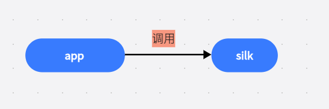
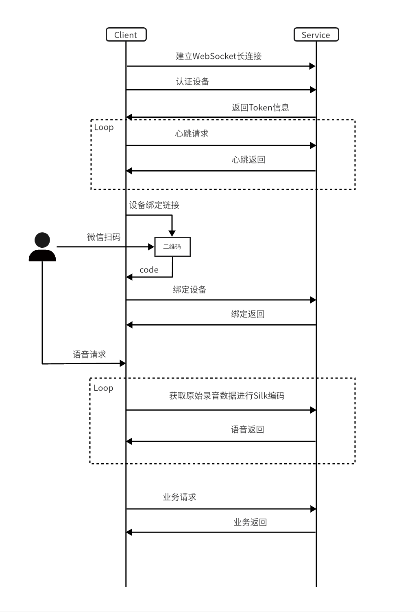

## XWOpenAPI
 
### 一、简介
#### 1.1 背景
为了更好的给小微用户提供开发与体验服务,腾讯小微团队提供了小微开放接口Demo。

#### 1.2 功能
- 腾讯小微语音对话能力
- pcmTosilk编码能力
- WebSocket与腾讯小微服务器建立长连接通信能力

### 二、开放接口
- [设备认证](https://developers.weixin.qq.com/doc/xwei/xiaowei-openapi/api_device_auth.html)
- [心跳服务](https://developers.weixin.qq.com/doc/xwei/xiaowei-openapi/api_heartbeat.html)
- [文本请求](https://developers.weixin.qq.com/doc/xwei/xiaowei-openapi/api_text.html)
- [语音请求](https://developers.weixin.qq.com/doc/xwei/xiaowei-openapi/api_voice.html)
- [更新设备属性](https://developers.weixin.qq.com/doc/xwei/xiaowei-openapi/api_update_device_attr.html)
- [获取设备属性](https://developers.weixin.qq.com/doc/xwei/xiaowei-openapi/api_get_device_attr.html)
- [微信扫码绑定设备](https://developers.weixin.qq.com/doc/xwei/xiaowei-openapi/api_wxcode_bind.html)
- [解绑设备](https://developers.weixin.qq.com/doc/xwei/xiaowei-openapi/api_unbind_device.html)

### 三、工程结构
moduleName|moduleFunction
----|-----
app|应用程序主module
silk|silk编码库，输出形式:aar文件，通过构建silk可以在silk/build/outputs/aar中找到对应aar

### 四、流程介绍
##### 4.1项目结构

##### 4.2交互流程


### 五、网络通讯
##### 5.1创建OkHttpClient对象
##### 5.2创建ClientWebSocketListener
##### 5.3通过OkHttpClient创建WebSocket且建立连接
##### 5.4发送请求
##### 5.5接收响应结果，通过ParseDataManager解析数据
```
    //创建WebSocket长链接
    public void webSocketConnect() {
        mOkHttpClient = new OkHttpClient.Builder()
                .connectTimeout(30, TimeUnit.SECONDS)
                .writeTimeout(30, TimeUnit.SECONDS)
                .readTimeout(30, TimeUnit.SECONDS)
                .build();
        Request request = new Request.Builder()
                .url(ConstantParams.HOST)
                .build();
        ClientWebSocketListener listener = new ClientWebSocketListener();
        mOkHttpClient.newWebSocket(request,listener);
        mOkHttpClient.dispatcher().executorService().shutdown();
    }
	
	//创建ClientWebSocketListener 
	private final class ClientWebSocketListener extends WebSocketListener {
        @Override
        public void onOpen(WebSocket webSocket, Response response) {
            mWebSocket = webSocket;           
        }

        @Override
        public void onMessage(WebSocket webSocket, String text) {
            Log.d(TAG,"mWebSocket onMessage = " + text);
			//解析数据管理器
            ParseDataManager.getInstance().parseData(text);
        }

        @Override
        public void onMessage(WebSocket webSocket, ByteString bytes) {
           Log.d(TAG,"mWebSocket onMessage = " + bytes.utf8());
        }

        @Override
        public void onClosing(WebSocket webSocket, int code, String reason) {
            Log.d(TAG,"mWebSocket onClosing = " + reason + " code := " + code);
            if(null != mWebSocket){
                mWebSocket.close(1000,"close web socket");
                mWebSocket=null;
            }
        }

        @Override
        public void onClosed(WebSocket webSocket, int code, String reason) {
            Log.d(TAG,"mWebSocket onClosed -- " + reason);
        }

        @Override
        public void onFailure(WebSocket webSocket, Throwable t,  Response response) {
            if (response == null) return;
            Log.d(TAG,"mWebSocket onFailure -- " + response.toString());
        }
    }
	
	/**
     * 发送语音请求
     * @param bytes
     * @param voiceSeq
     * @param isEndVoice
     * @param voiceLength
     * @param seq
     * @return
     */
    public boolean sendSpeech(byte[] bytes,int voiceSeq,boolean isEndVoice,int voiceLength,int seq) {
        if (mWebSocket == null) {
            Log.d(TAG,"mWebSocket is null");
            return false;
        }
        String speechOrder = new SpeechBean(mRequestId).toSpeechJson(bytes, voiceSeq, isEndVoice, voiceLength, seq);
        return mWebSocket.send(speechOrder);
    }
```
